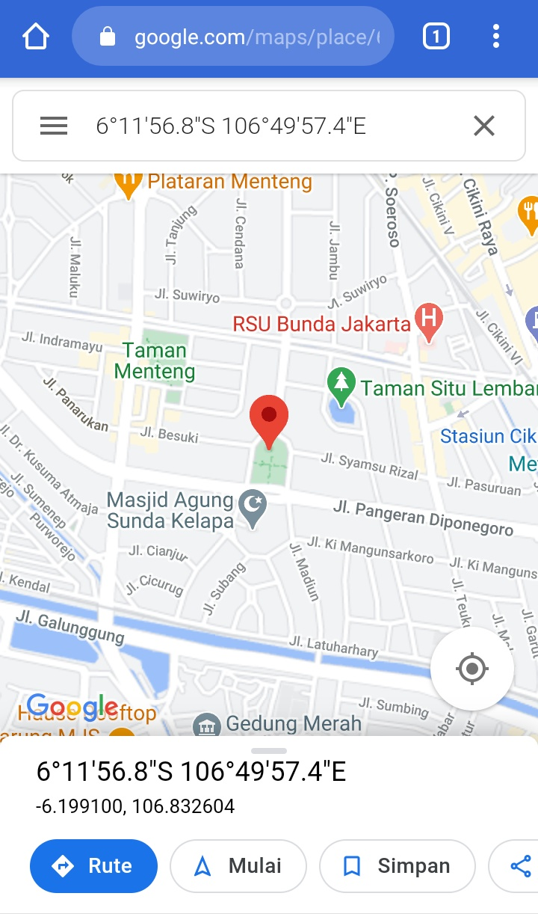

# iplog-chan
address tracking by pressing the url.
mixing with django web framework :3

## example result
Terminal Display   

  
google maps coordinate  

## module required
* django
* requests
* pyngrok

pip3 install -r requirements.txt

## For the first time using

* python3 track.py makemigrations
* python3 track.py migrate

after that you don't need to repeat the command

# usage <3
* python3 track.py runserver

